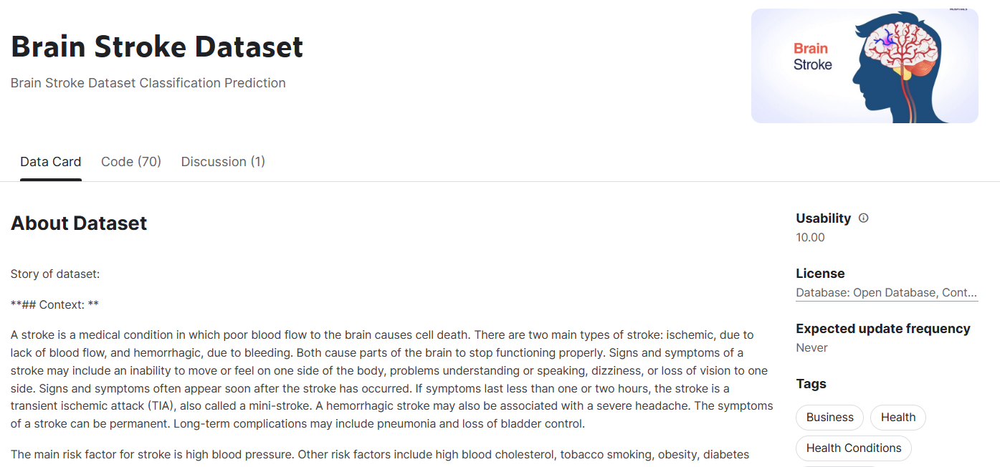
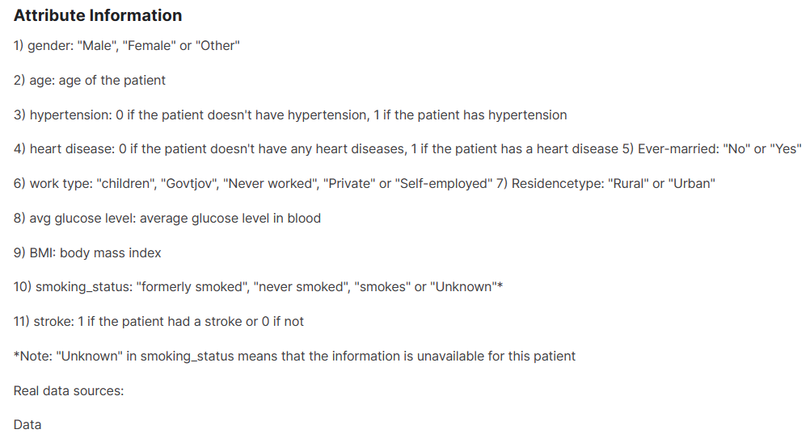
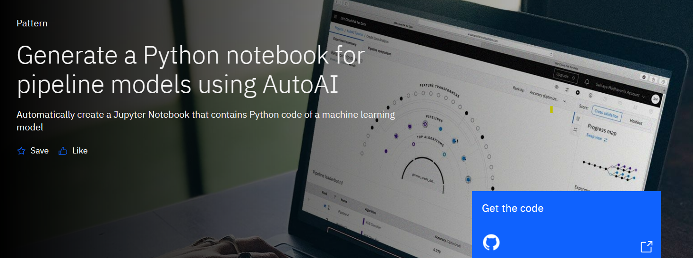
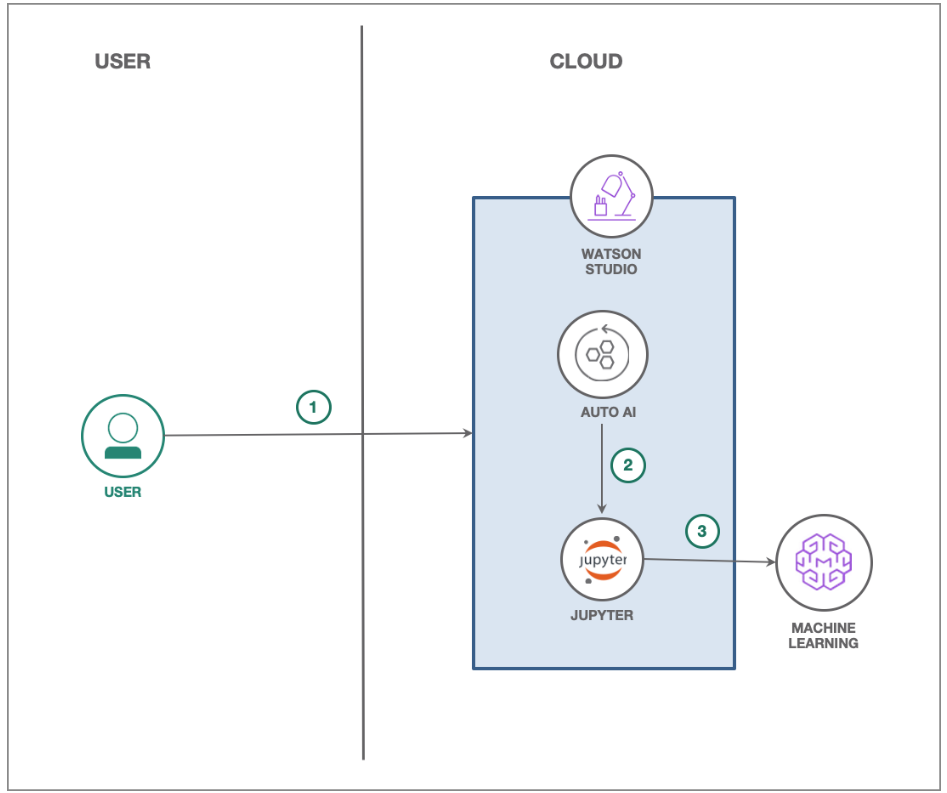
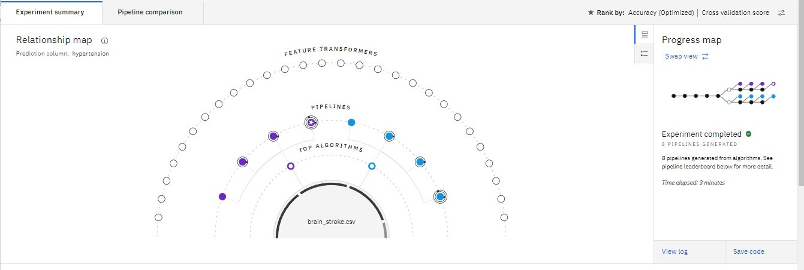
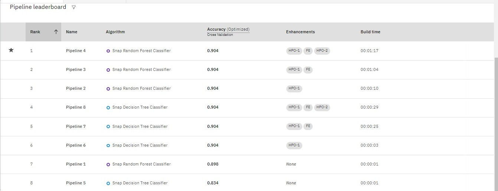
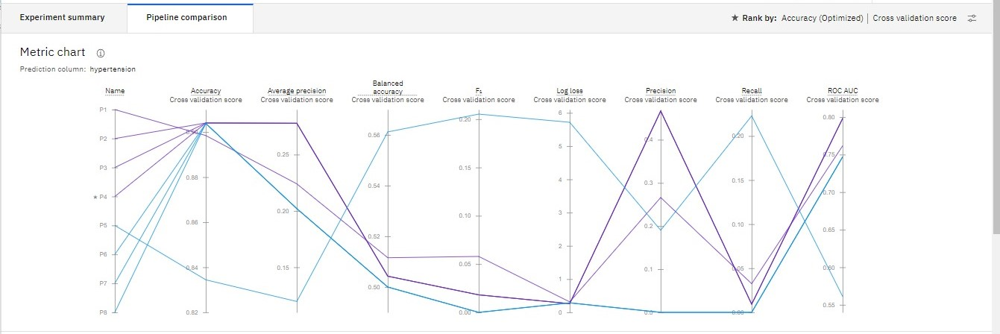
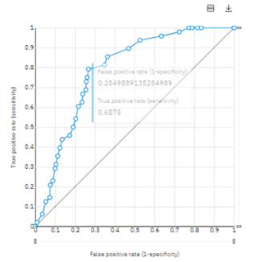
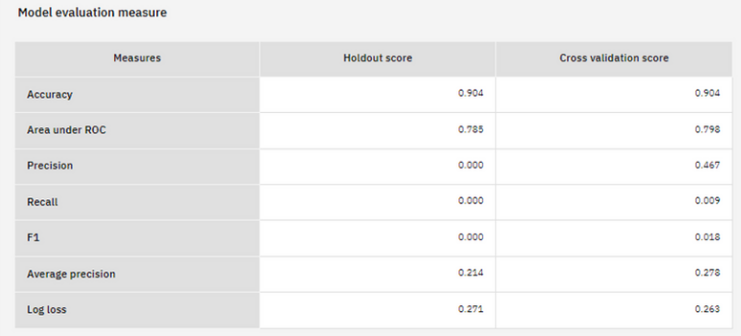
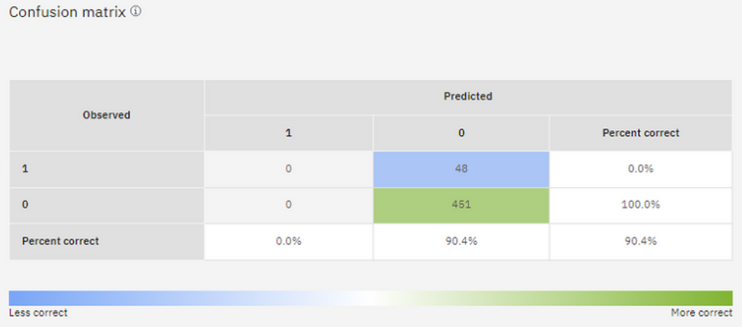

# Brain_Stroke_Effect_Hypertension_For_Pipeline_Models_Using_AutoAI
Ini adalah project capstoen implementasi dari materi Artificial Intelligance dan melibatkan penggunaan AutoAI untuk mendeteksi dan memprediksi risiko stroke otak melalui model pipeline. Menggunakan Layanan IBM

## Infinite Learning

Red Hat Certified System Administrator - IBM AI &amp; Cybersecurity.

| Keterangan | Data                     |
| ---------- | ------------------------ |
| Nama       | Sylviana Anggraini       |
| Asal       | Batam                    |
| Kampus     | Institut Teknologi Batam |
| Jurusan    | Teknologi Informasi      |
| Prodi      | S1 Sistem Informasi      |

## Keterangan Projek

### Dataset Brain Stroke

https://www.kaggle.com/datasets/jillanisofttech/brain-stroke-dataset

### Pattern yang dipakai

## Komponen

- [IBM Watson Studio](https://cloud.ibm.com/catalog/services/watson-studio)
- [IBM Watson Machine Learning](https://cloud.ibm.com/catalog/services/machine-learning)

### Flow

1. Pengguna mengirimkan percobaan AutoAI menggunakan pengaturan default.
2. Beberapa model pipeline dihasilkan. Model pipeline pilihan dari papan peringkat disimpan sebagai buku catatan Jupyter.
3. Notebook Jupyter dijalankan dan model pipeline yang dimodifikasi dibuat di dalam notebook.
4. Model pipeline digunakan di Watson Machine Learning menggunakan API WML.

## Hasil

## Kesimpulan

Berdasarkan hasil Predict Brain Stroke effect Hypertension with pipeline models using AutoAI, dapat disimpulkan bahwa:

- Algoritma yang digunakan adalah Snap Random Forest Classifier. Algoritma ini telah terbukti efektif dalam memprediksi efek Hypertension terhadap Brain Stroke.

- Model yang dikembangkan dengan menggunakan algoritma tersebut mencapai tingkat akurasi sebesar 0.904. Angka ini menunjukkan bahwa model memiliki kemampuan yang baik dalam mengklasifikasikan efek Hypertension terhadap brain stroke.

- Dilakukan beberapa peningkatan (enhancements) pada model, yaitu 1st dan 2nd Hyperparameter Optimization serta Feature Engineering. Peningkatan ini membantu meningkatkan performa model dengan mengoptimalkan parameter dan mengubah fitur yang digunakan.

Dengan hasil tersebut, studi ini memberikan pemahaman yang lebih baik tentang hubungan antara hypertension dan Brain Stroke. Model yang dikembangkan memiliki tingkat akurasi yang tinggi dan telah mengalami peningkatan melalui proses optimisasi parameter dan rekayasa fitur. Implikasinya, model ini dapat digunakan sebagai alat yang berguna dalam memprediksi dan memahami pengaruh hypertension terhadap kesehatan brain stroke.
